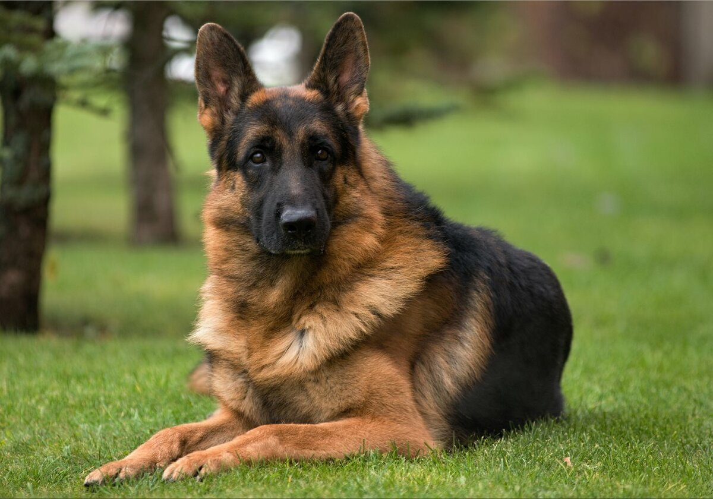

# Руководство пользователя языка Markdown

### 1. Заголовки 

Чтобы выделить заголовок, необходимо поставить от 1 до 6 решёток (#) и пробел в самом начале строки. 

# Заголовок 1 уровня
## Заголовок 2 уровня
### Заголовок 3 уровня
#### Заголовок 4 уровня
##### Заголовок 5 уровня
###### Заголовок 6 уровня

### 2. Подчёркивания
«Подчёркивание» параграфа знаками равно (=) или дефисами (-) делает его заголовком первого или второго уровня соответственно. Уровень заголовка зависит только от типа «чёрточек», их количество значения не имеет.

Заголовок 1 уровня
==================

Заголовок 2 уровня
------------------

Заголовок, который подчеркнули одним символом
-

Заголовок второго
уровня из нескольких
строчек текста
------------------

### 3. Ссылки

Markdown предлагает 3 стиля разметки ссылок: строчный, справочный и автоматический.

- Строчные

Для вставки ссылки в строчном стиле необходимо воспользоваться следующей конструкцией: [Текст ссылки]​(URL). Есть возможность добавить подсказку, для этого нужно после URL дописать текст в кавычках: [Текст ссылки]​(URL "Подсказка").

Привет, [Дока](https://doka.guide "Энциклопедия про web-dev")!

- Справочные

Для вставки ссылки в справочном стиле нужно написать [Текст ссылки]​[Ключ] в том месте, где вы хотите её поместить, а где-нибудь выше или ниже добавить сноску [Ключ]: URL "Подсказка".

У [Доки][1] есть свой [репозиторий][repo].

[1]: https://doka.guide "Энциклопедия про web-dev"
[repo]: https://github.com/doka-guide "Репозиторий Доки"

- Автоматические

Markdown позволяет использовать упрощённый вариант для вставки ссылок, для этого нужно просто обернуть URI треугольными скобками (<URI>).

Можно вставлять адреса электронной почты (<hi@doka.guide>), тогда мы автоматически получим ссылку типа mailto:.

Заходите на <https://doka.guide>
или присылайте нам письма на <hi@doka.guide>

### 4. Изображения

Конструкции для вставки изображений очень похожи на те, что используются для ссылок. Предлагается 2 стиля разметки: строчный и справочный.

+ Строчные

Для вставки изображения в строчном стиле необходимо воспользоваться конструкцией !⁠[Alt текст]​(URL картинки). При желании можно добавить подсказку: !⁠[Alt текст]​(URL картинки "Подсказка").

+ Справочные

Для вставки изображения в справочном стиле нужно написать !⁠[Alt текст]​[Ключ] в том месте, где вы хотите его поместить, а где-нибудь выше или ниже описать картинку по ключу [Ключ]: URL картинки "Подсказка".

![Одна собака][1]

[1]: dog.png "Собака смотрит влево"

